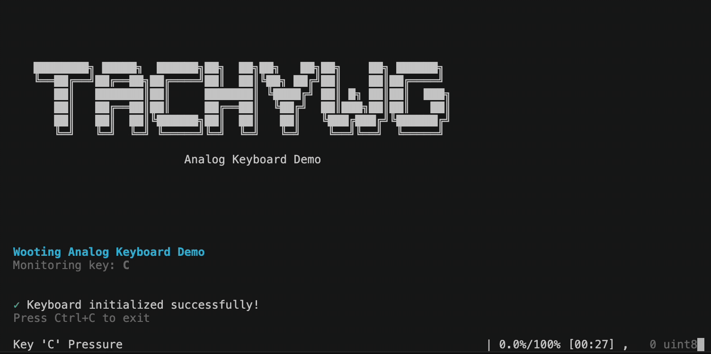

Console Scripts
===============

This package installs the following command-line scripts.

``wooting-demo``
----------------

Entry point:

.. code:: toml

   wooting-demo = "tachywooting.demos.cli:main"

Runs a terminal demo for reading analog pressure from a selected key.

   Wooting terminal demo

Typical use:

.. code:: bash

   wooting-demo --key A --threshold 50

Use this to quickly verify that the keyboard, native interface, and
pressure readout are working.

``wooting-build-interface``
---------------------------

Entry point:

.. code:: toml

   wooting-build-interface = "tachywooting.package_setup:run_post_install"

Runs post-install setup:

- Applies platform-specific permissions when needed.
- Builds the CFFI native interface.
- Applies macOS Gatekeeper fixes for bundled ``.dylib`` files.

Typical use:

.. code:: bash

   wooting-build-interface

Use this after installation if importing the package reports that the
native interface is missing.

``wooting-delete-interface``
----------------------------

Entry point:

.. code:: toml

   wooting-delete-interface = "tachywooting.package_setup:main_delete_interface"

Deletes generated CFFI interface artifacts and common cache files.

Typical use:

.. code:: bash

   wooting-delete-interface
   wooting-build-interface

Use this when you want to force a clean rebuild of the native interface.

``wooting-visualize``
---------------------

Entry point:

.. code:: toml

   wooting-visualize = "tachywooting.visualize:main"

Plots logged analog pressure traces from an HDF5 session file
(matplotlib).

Visual demos (TachyPy)
----------------------

The interactive fixation-cross demo and the mini black/white experiment
now ship with **TachyPy** — they require a display and the visual
feedback engine, so they are not part of this hardware package. See
:doc:`tachypy` for installation details and the direct demo commands.
